# PhoneShop

## I. Giới thiệu
PhoneShop là ứng dụng bán điện thoại trực tuyến được xây dựng bằng Flutter. Ứng dụng cho phép người dùng xem danh sách sản phẩm, xem chi tiết điện thoại, thêm vào giỏ hàng và thanh toán.

## II. Công nghệ sử dụng (Technologies Used)

- Front-end: Flutter
- Back-end: Express.js
- DataBase: MySQL, RailWay
  
## III. Hướng dẫn cài đặt (Installation)

### 3.1. Yêu cầu
- Flutter SDK phiên bản mới nhât
- Android Studio hoặc VS Code
- MySQL Workbench 8.0 CE

### 3.2. Cách chạy ứng dụng

**3.2.1. Clone repository:**

    git clone https://github.com/TQBao2ca3/DoAnLapTrinhDiDong.git

**3.2.2. Import phoneshop.sql file vào MySQL**

**3.2.3. Cài đặt dependencies:**

    flutter pub get

**3.2.4. Thay đổi địa chỉ IP ở file api_service.dart**
   - Đầu tiên ta sẽ lấy địa chỉ ip bằng cách mở cmd lên và gõ lệnh "ipconfig", và và kết quả sẽ như ảnh bên dưới, ta tìm mục Wireless LAN adapter Wi-Fi: và lấy địa chỉ ip IPv4 Adress:
    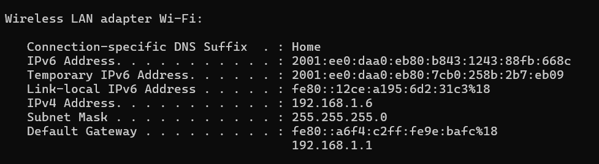
- Sau đó ta thay địa chỉ vừa lấy vào địa chỉ của file api_service.dart:
   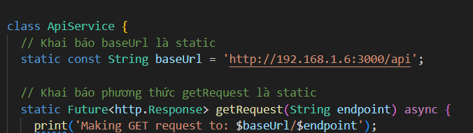

**3.2.5. Chạy server backend:**
   - Ta mở terminal lên và chạy câu lệnh: 
  
    npm run start-backend

   - **Lưu ý**: sẽ có một vài máy chạy không thành công câu lệnh này, nếu gặp trường hợp này ta sẽ phải điều hướng đến thư mục chứa file server.js để chạy câu lệnh:

    node server.js

**3.2.6. Chạy ứng dụng:**
   - Ta sẽ mở một tab terminal mới để chạy ứng dụng

    flutter run

## IV. Hình ảnh và demo

##### Đăng ký
  
  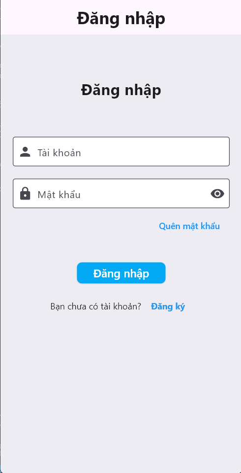

  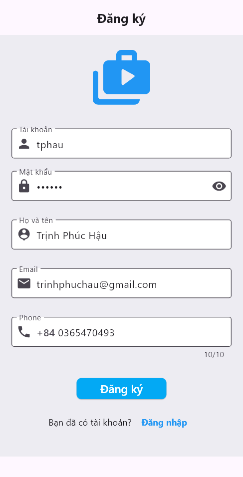
#### Sau khi đăng ký và đăng nhập xong thì màn hình sẽ hiển thị danh sách sản phẩm
  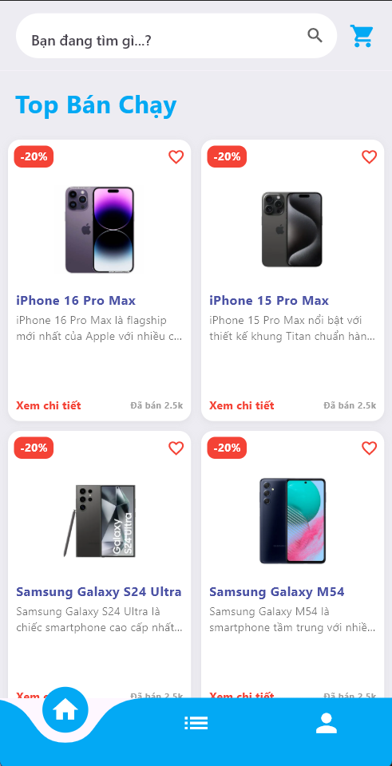
#### Ta có thể xem chi tiết sản phẩm với hình ảnh, mô tả và giá bán
  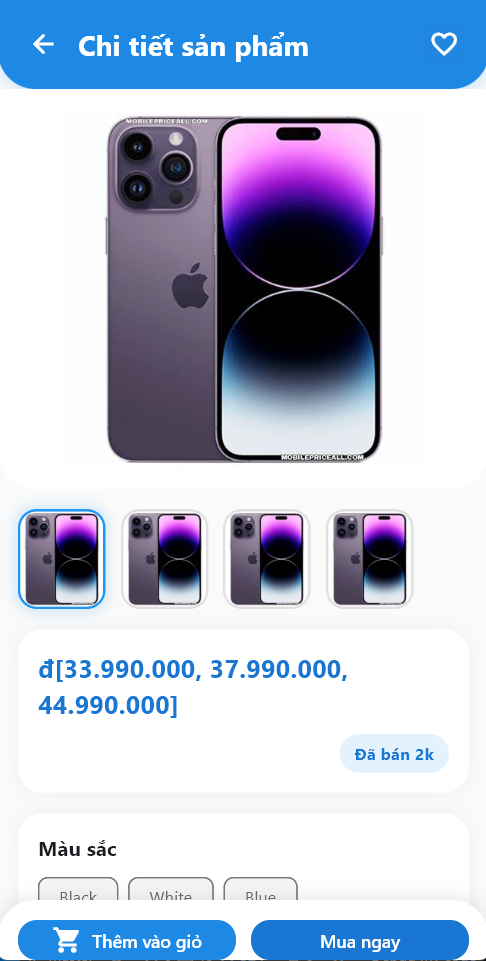
#### Thêm sản phẩm vào giỏ hàng.
  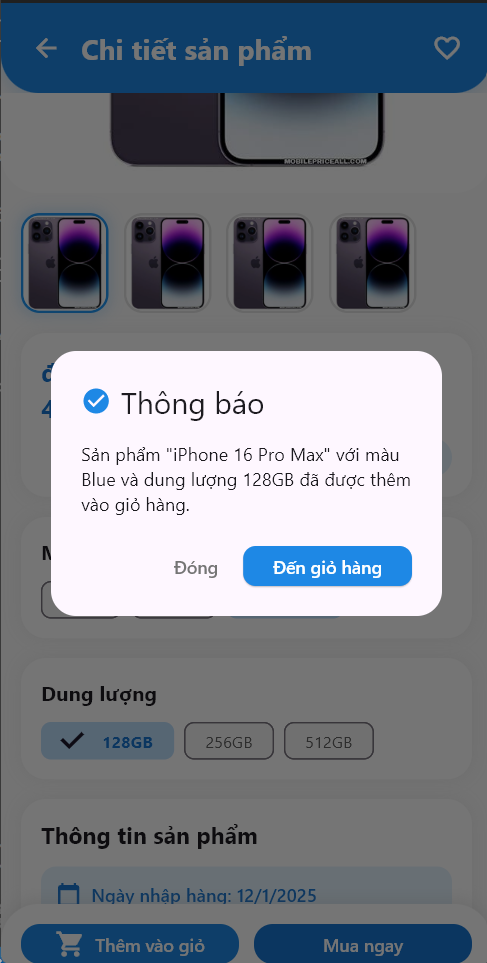
#### Sau khi thêm ta có thể điều chỉnh số lượng sản phẩm vừa được thêm trong giỏ hàng
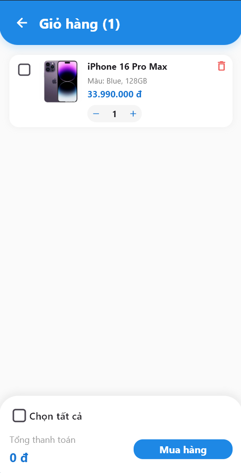
#### Thực hiện thanh toán đơn hàng
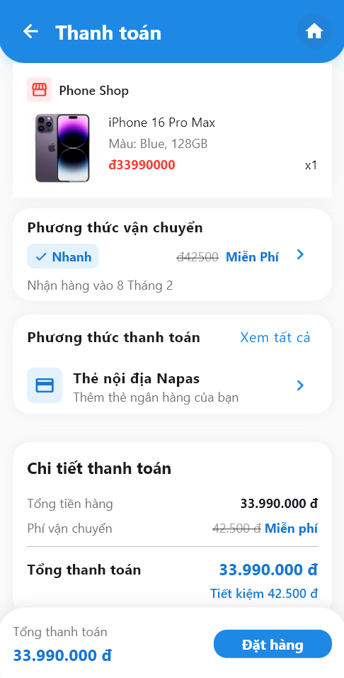
#### Ta có thể lựa chọn phương thức thanh toán
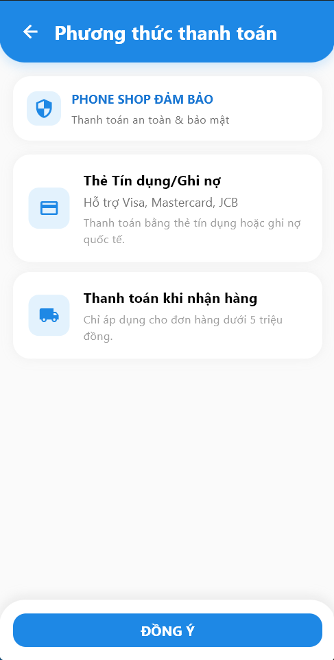
#### Ta có thể quản lý thông tin cá nhân và đơn hàng rong trang cá nhân
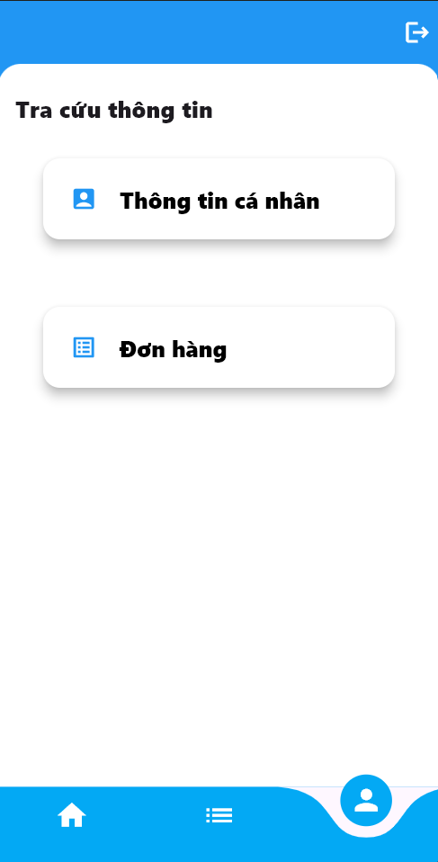

  
## V. Liên hệ & Đóng góp
Nếu bạn muốn đóng góp, vui lòng tạo Pull Request hoặc liên hệ với tôi qua email: work.trinhphuchau@email.com.
